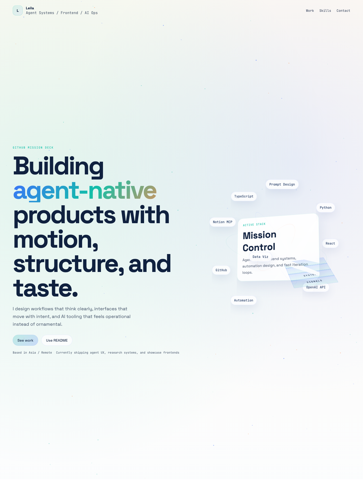

<!--
Optional edits before publishing:
- change `Leila` to your display name if needed
- change `Asia / Remote` if you want a location line
- add your own contact links later if you want them
-->

<p align="center">
  
</p>

<p align="center">
  
</p>

<h1 align="center">Leila builds agent-native products, visual frontends, and AI workflow systems.</h1>

<p align="center">
  <strong>AI Agent Engineering</strong> / <strong>Frontend Systems</strong> / <strong>Automation Design</strong>
</p>

<p align="center">
  <a href="https://helloleila.github.io/">Open the 3D mission deck</a>
  ·
  <a href="#featured-work">View featured work</a>
  ·
  <a href="#connect">Connect</a>
</p>

## Signal

I like interfaces that feel alive, workflows that remove friction, and AI systems that behave like real tools instead of demos. Most of what I build sits at the intersection of product taste, automation, and engineering systems.

## Build Lanes

| Lane | What I actually use |
| --- | --- |
| Agent Systems | `OpenAI API` `tool orchestration` `prompt design` `eval loops` `workflow automation` |
| Frontend Craft | `TypeScript` `JavaScript` `React` `Vite` `HTML/CSS` `motion systems` |
| Product Infrastructure | `Python` `Node.js` `GitHub Actions` `Notion MCP` `CLI tooling` |
| Research Ops | `AI source tracking` `knowledge capture` `structured notes` `content systems` |

## Current Focus

- Designing agent-first product flows that feel understandable, not magical.
- Turning messy information streams into structured, reusable research assets.
- Building GitHub-ready showcases that look more like product posters than plain READMEs.

## Featured Work

<a id="featured-work"></a>

- Moonforge Gate: agent workflow infrastructure with stronger execution boundaries and repo automation.
- Realtime QA Demo: a fast surface for testing flows and tightening product feedback loops.
- AI Signal Directory: a curated AI source map converted into GitHub-friendly, clickable follow lists.

## Skill Constellation

`AI Agents` `Prompt Engineering` `Automation` `TypeScript` `Python` `React`
`Notion Workflows` `GitHub Pages` `Data Visualization` `UX Prototyping`
`Research Systems` `CLI Design` `Docs Systems` `Creative Frontend`

## Now Shipping

```text
Mode: BUILD
Location: Asia / Remote
Focus: agent UX / visual frontends / information systems
Status: open to sharp product experiments and unusual tooling ideas
```

## Connect

- Mission Deck: [3D homepage](https://helloleila.github.io/)
- Profile README: [this file](./README.md)
- Contact slot: add your email / Telegram / X link here whenever you want

The interactive version of this profile lives in this repo's `index.html`, designed for GitHub Pages.

To refresh the static preview screenshot locally, run:

```bash
./capture-preview.sh
```
